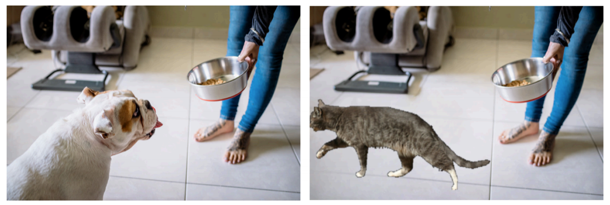

# Image Collage



TBD 

Abstract: 
Generating image descriptions has been a popular task
in computer vision in recent years. Popular image datasets
for this task such as the MS-COCO dataset include image
captions collected using crowdsourcing. However, these de-
scriptions might not apply to other image domains where
context plays a bigger role. We focus on this work in de-
scribing historical photographs obtained from the US Li-
brary of Congress. In our project we explore the use of an
encoder-decoder framework where the input image is used
as input to a convolutional neural network (CNN), and the
output is fed onto a recurrent neural network (RNN) that
translates visual features into language. We train our model
on descriptions from the US Library of Congress, and com-
pare its performance to a model trained on the MS-COCO
Dataset using standard metrics. We show that using both
in-domain images and text are crucial to obtain competitive
performance on this task.


## Installation

Some important libraries

```shell
pip install torch torchvision torchaudio  # pytorch
pip install opencv-python  # opencv
pip install PIL  # PIL
pip install numpy pandas matplotlib  # others


# For CLIP 
pip install transformers

# For remove_anything
cd remove_anything
pip install -e segment_anything
pip install -r lama/requirements.txt

# For Front end
pip install gradio

```

You can also use `environment.yml` to install
```shell
conda env create -f evironment.yaml
```

## Data preparation

### Dataset
We use **Pascal VOC 2012** dataset to build our segment pool.

1. First, download the dataset from [Kaggle](https://www.kaggle.com/datasets/huanghanchina/pascal-voc-2012)
2. Modify the path variables `root` and `output_dir` in `utils/data_preprocesser.py` and run it
    ```python
    # modify the path in `utils/data_preprocesser.py`
    root = "{your_dataset_path}"
    output_dir = "{path_of_this_repo}/segments_pool"

    # run in Shell
    python utils/data_preprocesser
    ```

Then, there be a directory called `segments_pool` under the root of this porject.

### Model Checkpoints

You need to download checkpoints of `remove_anything`, which includes two models [SAM](https://github.com/facebookresearch/segment-anything) and [Lama](https://github.com/advimman/lama), from [Google drive](https://drive.google.com/drive/folders/1ST0aRbDRZGli0r7OVVOQvXwtadMCuWXg). You can also download it using command line:

```shell
pip install gdown
gdown https://drive.google.com/drive/folders/1wpY-upCo4GIW4wVPnlMh_ym779lLIG2A-O removing_anything/pretrained_models --folder  # download to remove_anything folder
```

In addition, `CLIP` will be downloaded during run time.


## Main components and technologies

* Dataset and Segment Pool
  * dataset: pascal voc 2012 for segmentation
  * segment pool: extract segments from the dataset and get a segment pool
* Core Models(Modules) for Image Collages
  * Gounded SAM & SAM: segments input image from users (with/without prompts) and get the object the users what
  * LaMa: remove the original object in the image and inpaint the original image
  * CLIP: retrieve segments that are most relevant to users' prompt from our segment pool
  * Our own algorithm:
    * replace the original object with the most suitable object from the retrieved segments
    * adjust the position/pose of our segment to make the image better and reasonable
  
  **Pay attention** Inpant-anything (remove-anything) is the combination of SAM and LaMa, we can use it
* Front End
  * Gradio: implement the use case
* Other Optimizations/New Features if possible


## Getting started

After preparation, just run `python demo.py`, you can enjoy our application that looks like the following figure


The general usage is 
1. user inputs an image
2. the GUI shows the input image
3. user inputs prompt (clicks the image or uses text prompt) to select an object in the image
4. user inputs a text prompt then our system replaces the selected object with the most relevant object retrieved from the segment pool
5. user can repeat step 3-4 to modify the input image 


