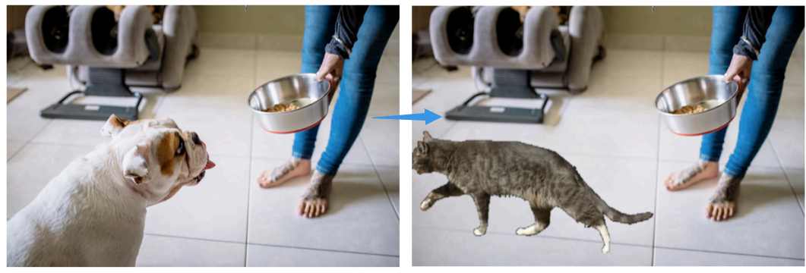
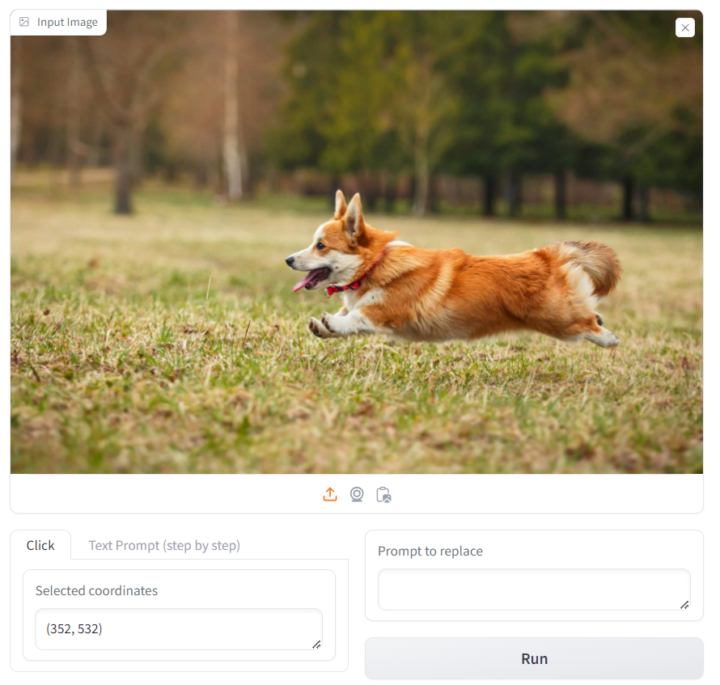
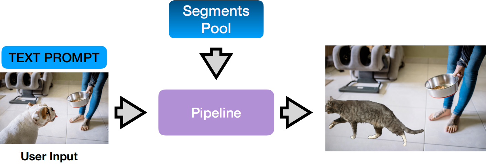

# Image Collage



This project integrates state-of-the-art computer vision techniques to address these challenges. Utilizing a segments pool from the
Pascal VOC 2012 dataset, we leverage the Segment Anything Model (SAM) for precise object segmentation, followed by LaMa for resolution-robust inpainting. 
The Contrastive Language–Image Pre-training (CLIP) model is then employed to retrieve and position contextually relevant segments from the pool based on textual prompts. 
We present an automated pipeline that scales and places these segments into the voids left by object removal, focusing onmaintaining the original image’s perspective 
and proportions. Our results demonstrate the pipeline’s effectiveness in various scenarios, albeit with some limitations in the refinement stage, 
where traditional blending methods like diffusion and seamlessClone were less successful. This report provides a comprehensive analysis of our methodology, 
results, and the potential avenues for advancing automated image editing.


## Installation

Some important libraries

```shell
pip install torch torchvision torchaudio  # pytorch
pip install opencv-python  # opencv
pip install PIL  # PIL
pip install numpy pandas matplotlib  # others


# For CLIP 
pip install transformers

# For remove_anything
cd remove_anything
pip install -e segment_anything
pip install -r lama/requirements.txt

# For Front end
pip install gradio

```

You can also use `environment.yml` to install
```shell
conda env create -f evironment.yaml
```

## Data preparation

### Dataset
We use **Pascal VOC 2012** dataset to build our segment pool.

1. First, download the dataset from [Kaggle](https://www.kaggle.com/datasets/huanghanchina/pascal-voc-2012)
2. Modify the path variables `root` and `output_dir` in `utils/data_preprocesser.py` and run it
    ```python
    # modify the path in `utils/data_preprocesser.py`
    root = "{your_dataset_path}"
    output_dir = "{path_of_this_repo}/segments_pool"

    # run in Shell
    python utils/data_preprocesser
    ```

Then, there be a directory called `segments_pool` under the root of this porject.

### Model Checkpoints

You need to download checkpoints of `remove_anything`, which includes two models [SAM](https://github.com/facebookresearch/segment-anything) and [Lama](https://github.com/advimman/lama), from [Google drive](https://drive.google.com/drive/folders/1ST0aRbDRZGli0r7OVVOQvXwtadMCuWXg). You can also download it using command line:

```shell
pip install gdown
gdown https://drive.google.com/drive/folders/1wpY-upCo4GIW4wVPnlMh_ym779lLIG2A-O removing_anything/pretrained_models --folder  # download to remove_anything folder
```

In addition, `CLIP` will be downloaded during run time.

## Getting started

After preparation, just run `python demo.py`, you can enjoy our application that looks like the following figure


The general usage is 
1. user inputs an image
2. the GUI shows the input image
3. user inputs prompt (clicks the image or uses text prompt) to select an object in the image
4. user inputs a text prompt then our system replaces the selected object with the most relevant object retrieved from the segment pool
5. user can repeat step 3-4 to modify the input image 




